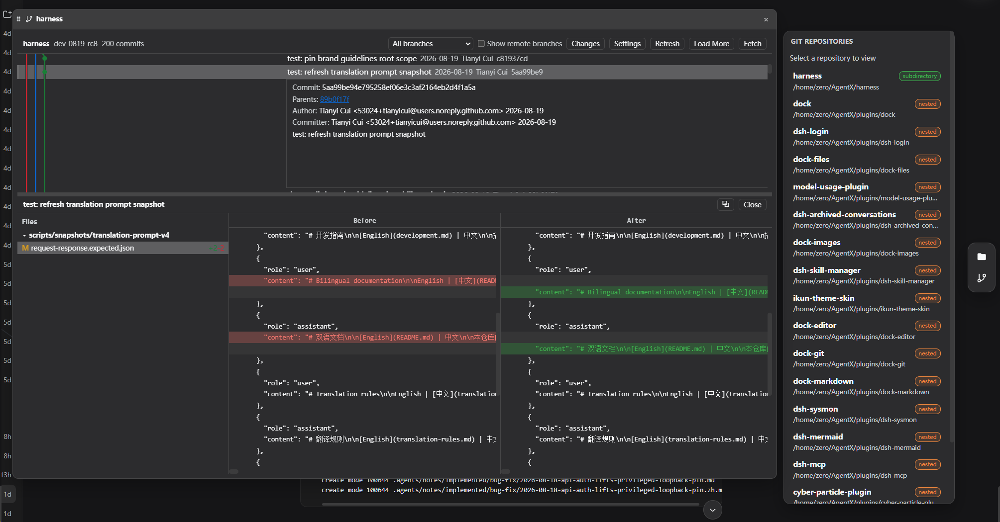

# dock-git

[中文](README.md)

Git history visualization plugin of the dock family: mounts a side-bar launcher (activity item `git`) that renders the current workspace's git commit history graph (commits / branches / tags / remotes) and supports branch, tag, config, remote, stage, commit and push operations.

## Preview



## Features

- **Commit history graph**: swimlane graph with branch/tag/remote badge glyphs and an "uncommitted changes" node; N+1 probe for "more commits".
- **Commit details**: expand a commit to see the message, author, changed-file tree (added/modified/deleted/renamed), old/new file content three-column view, and diff (512 KiB truncation, UTF-16 safe).
- **Multi-repo discovery**: scans the session workspace (cwd plus two levels of subdirectories) for independent git repositories and lets you switch the target.
- **Branch/tag management**: create, rename, delete branches; create/delete tags; checkout via `git switch` (no path-semantics ambiguity).
- **Staging and commit**: VSCode-style status/stage/unstage/commit (`--no-verify`, repository hooks never run).
- **Remote operations**: list / add / remove / set-url, fetch, pull, fetch-into, push (branch/tag, `--force-with-lease` supported).
- **Config read/write**: read any repository config; writes are limited to `user.name` / `user.email`.
- **i18n**: built-in Chinese/English UI following the DSH global locale.

## Install

Requires the `dock` base plugin:

```sh
dsh plugin add github:AKS1st/dock
dsh plugin add github:AKS1st/dock-git
```

## Security

- The `/wb-git` route only accepts POSTs from trusted origins (loopback / trustedHosts plus same-origin check).
- git is always spawned directly with an argument vector (never a shell string); the environment is sanitized (GIT_DIR / GIT_WORK_TREE removed, fixed C locale).
- Every user-controlled argv position is validated: ref names, remote names, config keys, stage paths, commit messages, ... — leading `-` (option injection), `..` / `@{` (range/refspec smuggling), pathspec magic (`:`), control characters and NUL are all rejected.
- `repoRoot` is confined to the session workspace (realpath prefix comparison) — git cannot run in arbitrary directories.
- High-output commands (log / diff / show / status) carry a streaming byte cap; exceeding it kills the child so the host never OOMs.
- Checkout uses `git switch`, which never falls back to path semantics (working-tree files cannot be accidentally restored).

## License

MIT
